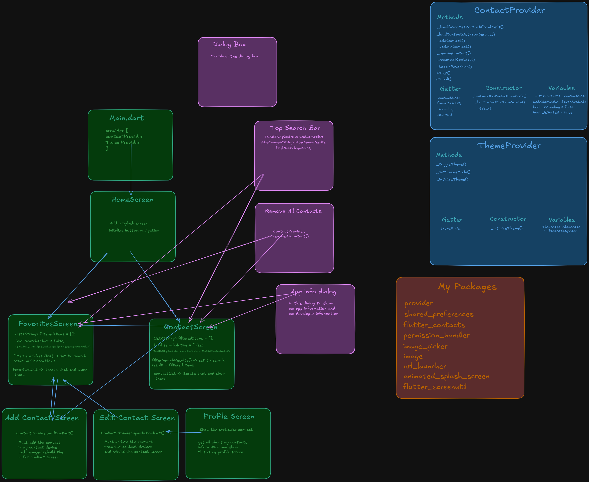

# ContactSphere - Smart Contact Management App


## Overview 📙

ContactSphere is a powerful and user-friendly contact management app built using Flutter and Dart. With an intuitive design and smooth performance, it allows users to effortlessly add, edit, delete, and remove all contacts while also managing a favorites list for quick access to important connections.

With ContactSphere, organizing your contacts has never been easier! 🚀

## 🌟 Features

- 📞 Add, Edit & Delete Contacts – Manage your contacts with ease.
- 🔍 Search Contacts Quickly
- 🌙 Dark & Light Mode Support – Customize the app’s appearance.
- 🖼️ Contact Avatar & Avatar Image Picker – Set profile pictures for a personalized experience.
- 🏷️ Categorization & Tagging of Contacts
- 📂 Backup & Restore Feature (Coming Soon)
- 🎨 Smooth & Intuitive UI with Material Design
- 📃 Favorites List – Mark important contacts for quick access.

## Screenshots 📷

### Light Mode ☀

<!-- Add 3d Light Mode Mockup -->


---

### Dark Mode 🌙

<!-- Add 3d Dark Mode Mockup -->


---

## Design & Behind the Scenes 🎨

- **Figma Design**: [View Design](https://www.figma.com/design/gbadI6FPuoFFFyZykVoBbj/ContactApp-Mobile?node-id=0-1&p=f&t=02IW2HtSjPRmBMli-0)
- **Behind the Scenes**: 

---

## 🛠️ Tech Stack

- **Flutter** (Latest Stable Version)
- **Dart** (Powerful and Optimized)
- **Provider** (State Management)
- **Shared Preferences** (Local Storage)
- **Image Picker** (Pick the Image from the gallery)
- **Image** (Image a many formats to save locally)
- **Url Launcher** (Redirect to another URL)
- **Animated Splash Screen** (Custom Splash Screen)
- **Flutter Contacts** (Contact Package)
- **Flutter Screenutil** (Make a responsive design)

## 🚀 Installation

### Prerequisites:

- Install [Flutter](https://flutter.dev/docs/get-started/install)
- Ensure you have an active **Flutter** environment setup.

### Steps:

1. Clone this repository:
   ```bash
   git clone https://github.com/naveddeveloper/contactsphere.git
   ```
2. Navigate to the project directory:
   ```bash
   cd contact_app
   ```
3. Install dependencies:
   ```bash
   flutter pub get
   ```
4. Run the app:
   ```bash
   flutter run
   ```

## 📂 Project Structure

```
contact_app/
│── lib/
│   ├── providers/
│   ├── screens/
|   |-- styles/
|   |-- utils/
│   ├── widgets/
|   |-- main.dart
│── assets/
│── pubspec.yaml
|-- LICENSE
│── README.md
```

## Don't forget to :star: the repository.

## 🤝 Contributing

Pull requests are welcome! Feel free to fork this repository and submit a PR with your improvements.

## 📧 Contact Me

I'm the developer behind this project! You can check out more of my work here:

- 🌐 **GitHub**: [Your GitHub](https://github.com/naveddeveloper)
- 📩 **Email**: ansarinavedhabeeb@gmail.com
- 📷 **Instagram**: [Click to open my instagram account](https://instagram.com/naveddeveloper)

## Feedback 💬

If you have any suggestions, feel free to open an issue or contact me on [Instagram](https://www.instagram.com/naveddeveloper).

## Download the APK

[](https://github.com/naveddeveloper/ContactSphere/blob/main/contactsphere.apk)

## ⚖️ License

This project is licensed under the **MIT License**.

---

🌟 If you like this project, don't forget to ⭐ the repo!
